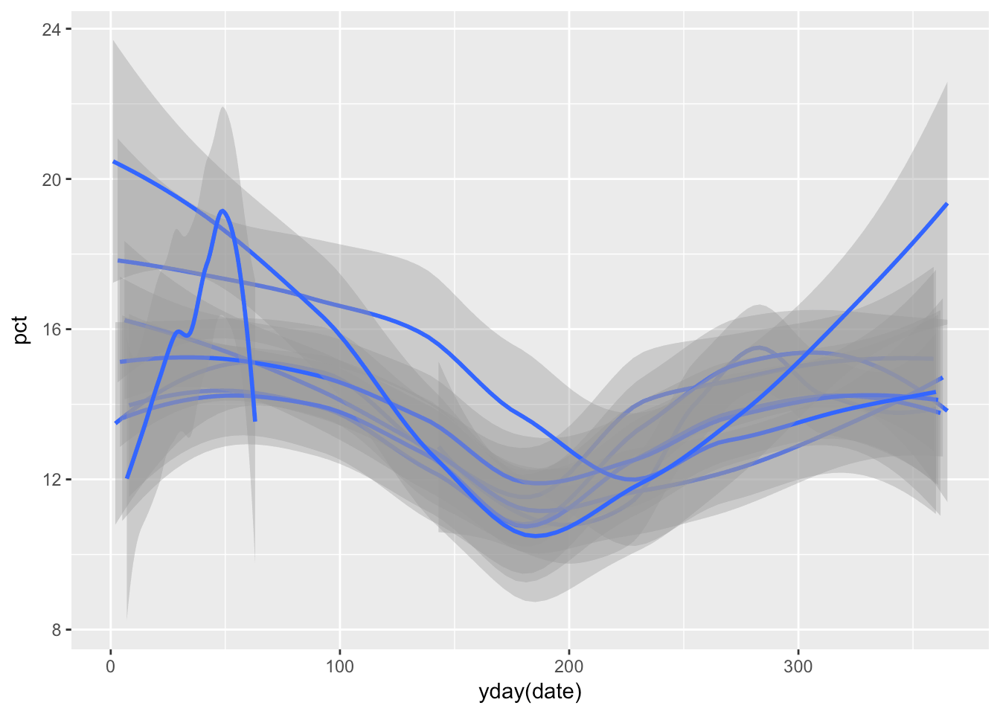
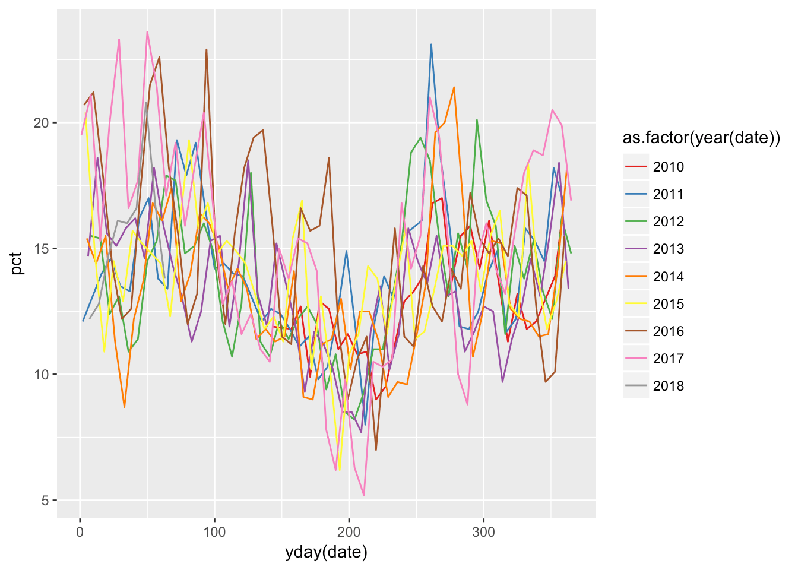

The aim of this workshop is to use R and some of the tidyverse packages to create quick-and-dirty visualisations that help you understand your data source. It is a useful way to explore data, and if creating charts etc is fast and easy, throwaway visualisations are an excellent way to quickly get a grasp of your source data.

Since May 2010 Gallup have surveyed levels of sickness in Icelandic workplaces. There is a [fuller explanation of the data] on Gallup's website.

A snapshot of this data available at <http://dataviz.flother.is/2018/data/sick_days.csv>. The snapshot was created by saving the data file used by the  embedded chart and converting it from JSON to CSV using [jq]:

```
jq -r '["date", "healthy", "sick"], (.results[].result.data.dsr.DataShapes[].PrimaryHierarchy[].Instances[].Calculations | [.[0].Value[9:19], .[1].Value[0:-1], .[2].Value[0:-1]]) | @csv' ~/Desktop/sick_days.json | xsv fmt > sick_days.csv
```

First we load the R packages we're going to use, then load the data.


```r
library(tidyverse)
library(lubridate)

veikindadagar <- read_csv('http://dataviz.flother.is/2018/data/sick_days.csv') %>%
  gather(key = 'type', value = 'pct', healthy, sick)
```

Next we replicate the chart used on Gallup's website.


```r
ggplot(veikindadagar, aes(date, pct, group = type)) +
  geom_line()
```


Let's limit the dataset to only the data we're interested in and remove the healthy days data.


```r
sick_days = veikindadagar %>%
  filter(type == 'sick') %>%
  select(date, pct)
```

Look at the summary of the data.


```r
summary(sick_days)
```

```
##       date                 pct       
##  Min.   :2010-05-23   Min.   : 5.20  
##  1st Qu.:2012-05-18   1st Qu.:11.80  
##  Median :2014-04-23   Median :13.85  
##  Mean   :2014-04-21   Mean   :14.04  
##  3rd Qu.:2016-03-28   3rd Qu.:15.80  
##  Max.   :2018-03-04   Max.   :23.60
```

Let's plot only sick days.


```r
ggplot(sick_days, aes(date, pct)) +
  geom_line()
```


Let's plot only sick days but add a trend line. This will use a locally-weighted regression.


```r
ggplot(sick_days, aes(date, pct)) +
  geom_line() +
  geom_smooth()
```


Let's plot only sick days but add a linear regression.


```r
ggplot(sick_days, aes(date, pct)) +
  geom_line() +
  geom_smooth(method = 'lm')
```


Now let's look at splitting the years out.


```r
ggplot(sick_days, aes(date, pct)) +
  geom_line() +
  facet_wrap(~ year(date))
```


Before that can be useful we need to use the day of the year on the x-axis, not the full date.


```r
ggplot(sick_days, aes(yday(date), pct)) +
  geom_line() +
  facet_wrap(~ year(date))
```


Let's add a trend line to the chart.


```r
ggplot(sick_days, aes(yday(date), pct)) +
  geom_line() +
  geom_smooth() +
  facet_wrap(~ year(date))
```


Let's take another tack and plot the individual year trends.


```r
ggplot(sick_days, aes(yday(date), pct, group = year(date))) +
  geom_smooth()
```



The margins of errors are of course statistically useful, but for purposes here we want a better view of the trend lines.


```r
ggplot(sick_days, aes(yday(date), pct, group = year(date))) +
  geom_smooth(se = FALSE)
```


```r
# ... Colour each year differently.
ggplot(sick_days, aes(yday(date),
                      pct,
                      group = year(date),
                      colour = as.factor(year(date)))) +
  geom_smooth(se = FALSE) +
  scale_color_brewer(type = 'qual', palette = 'Set1')
```


Let's add a legend and colour the individual years so we can pinpoint them more easily.


```r
ggplot(sick_days, aes(yday(date),
                      pct,
                      group = year(date),
                      colour = as.factor(year(date)))) +
  geom_line() +
  scale_color_brewer(type = 'qual', palette = 'Set1')
```



What about the trend throughout the year?


```r
ggplot(sick_days, aes(day(date), pct)) +
  geom_smooth() +
  facet_wrap(~ month(date, label = TRUE), nrow = 1)
```


That trend in February looks interesting. Let's focus on that.


```r
sick_days %>%
  filter(month(date) == 1) %>%
  ggplot(aes(day(date), pct, group = year(date))) +
  geom_line() +
  geom_hline(aes(yintercept = mean(pct)), colour = 'blue')
```


And finally what about comparing all months in all years to the monthly mean?


```r
sick_days %>%
  ggplot(aes(day(date), pct, group = year(date))) +
  geom_line() +
  geom_hline(aes(yintercept = mean(pct)), colour = 'blue') +
  facet_wrap(~ month(date))
```


For a larger project it would be interesting if we could find breakdowns of this data (sick days by sex, age, and industry), and if we could compare data for Iceland to other countries.


  [fuller explanation of the data]: http://www.gallup.is/nidurstodur/veikindadagar/
  [jq]: https://stedolan.github.io/jq/
